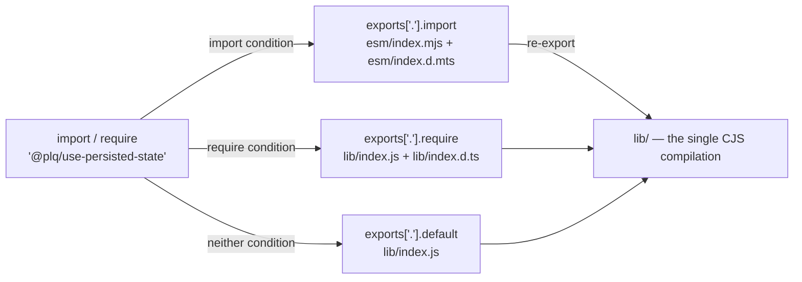

# Packaging

The package ships **one compilation**: `lib/`, produced by `tsc` as CommonJS. Everything else in the
published tarball points at it.

That is a deliberate constraint rather than an unfinished migration. The storage adapters keep their
listener registries in module-level state, so a second compiled copy of the library would carry a
second registry: a hook loaded through `import` would stop seeing writes made through `require` in the
same tab. `esm/` therefore contains hand-written wrappers that re-export `lib/`, not a second build.

For the same reason the package must **not** gain `"type": "module"`, `sideEffects: false`, or a real
dual build, and must keep `main` and `types` for resolvers that never read `exports`.

## Why the wrappers are committed while `lib/` is not

They look like build output and are not: nothing in this repository generates them. `lib/` is the
build output, and it is correctly absent from git. `esm/` and `storages/` are sources that happen to
be small.

Generating them instead was measured rather than argued: the generator came to 101 lines against 87
lines of wrapper, because the export names cannot be read statically out of the CommonJS build and
have to be collected at runtime, which drags in the same global stubs the smoke test needs. It would
also drop the comments that explain the constraint — the part worth keeping.

The obvious objection is drift: add an adapter, forget its wrapper. That fails loudly. `publint` and
`attw` name the missing file, `check:smoke` catches a wrapper whose shape no longer matches the
build, and `check:types` catches a declaration re-exporting a name that is gone.

Reaching for a dual-package builder — tshy, pkgroll, unbuild, tsdown — is the one move to avoid. All
of them emit two compiled copies, which is the second registry this whole layer exists to prevent.

## What resolves to what

| Specifier | Purpose |
| --- | --- |
| `.` and `./storages/*` | The documented entry points. Both module systems, correct types for each. |
| `./lib` and `./lib/*` | The paths older READMEs documented. Frozen: raw CJS, no wrapper. |
| `./src` and `./src/*` | Compatibility only, not a supported entry point. See below. |
| `./package.json` | Required by some tooling. |

### The rule the map follows

**The map keeps resolving every path a consumer can import.** Before this change the package had no
`exports` field at all, so every path inside the published tarball resolved for every consumer. An
`exports` field is the first thing capable of taking one of those away, and taking away a path
someone imports would be a regression introduced by the very mechanism added to prevent regressions.

That is a principle about importable paths, not a claim that nothing in the tarball changed
reachability, and the difference is measured rather than asserted. Packing both versions, installing
each into a throwaway consumer and resolving every published file as a specifier: without the map all
83 files resolve; with it, 74 of 111 do not, and 50 of those 74 shipped before — 32 `.map` files, 16
`.d.ts` files, `LICENSE` and `README.md`.

Not one of the 50 is a specifier anybody writes, which is where the principle holds. `exports`
governs specifier resolution, not file access: every one of those files is still in the tarball and
still readable by path. Source maps are fetched by relative URL from the emitted `.js`, declarations
reach TypeScript through the `types` condition in the map, and `LICENSE` and `README.md` are read
from the package directory by tooling that never resolves them as specifiers. No broken consumer has
been produced.

The narrowing is confined to resolvers that implement `exports` — `node16` and `bundler`. Under
`moduleResolution: node`/`node10` nothing narrows at all, because that resolver never reads the
field.

That rule decides both awkward cases below — `./lib/*` and `./src/*` — and it decides them the same
way, which is the point. Closing either one is a future major's work, announced as such. The map is
what makes that possible at all; today there is no mechanism.

### `import` is not nested under a `node` condition

An earlier draft of the map nested `import` inside `"node"`, on the theory that only Node needs the
wrapper. That kept the fix away from most consumers — bundlers do not match `node`, so they fell
through to `default` and got raw CJS.

That was not a neutral fallback. Rolldown (Vite 8), esbuild and webpack 5 all follow Node's interop
for a default import of a CommonJS module, so `import createPersistedState from '@plq/use-persisted-state'`
handed back `module.exports` — an object, not the function — and
`import storage from '@plq/use-persisted-state/storages/local-storage'` handed back
`{ __esModule, default }` instead of the adapter. The documented usage was broken under every bundler
tested. Routing `import` to the wrapper for all runtimes fixes it, and cannot reintroduce the
dual-package hazard because the wrapper is not a second copy.

`smoke-consumer.mjs` locks this down: it asserts that a listener registered through `import` fires on a
write made through `require`.

### `./lib/*` stays open, including the internal utilities

`"./lib/*": "./lib/*.js"` exposes every module under `lib/`, `lib/utils/` included. That is the rule
above applied literally: `require('@plq/use-persisted-state/lib/utils/is-async-storage')` resolves on
the released 1.3.0, so the map keeps it resolving.

The risk of leaving them open is low. The adapters keep their routing in closures; an outside caller
cannot obtain those objects, and removing a route with a foreign object is a no-op. The worst a
consumer achieves is subscribing to their own events that nothing addresses.

**The cost is real and points upstream.** Everything that lands in `lib/` — internal helpers included
— becomes a compatibility obligation the moment it ships. That is an argument against adding modules
under `src/utils/` without need, not an argument against the map. The map is also what makes a
deliberate, announced closure possible at a future major; without it there is no mechanism at all.

**One reason for keeping it open has since gone.** `Storage` and `AsyncStorage` used to live only
under `lib/@types/`, so the README sent every TypeScript consumer writing an adapter into `lib/`, and
the path was documented rather than merely historical. The entry point exports the contract types
now, and every surviving mention of a `lib/` path marks it as a legacy path that still resolves
rather than as the way in; no example reaches for one. That changes no decision here — the rule
above turns on what resolves today, not on what is documented — but the case for the pattern is one
argument shorter, and a future major closing it has one less thing to replace first.

An allowlist — replacing the pattern with one entry per module that exists today — would freeze the
surface at its current members while keeping every path that resolves today. It was not taken: it
turns the map into a hand-maintained list that has to track build output, which is the same drift the
wrapper declarations were rewritten to eliminate, and it fails by silently hiding a module someone
meant to publish. It also only half-closes anything, since `node10` resolvers and bundlers that ignore
`exports` still reach the files in the tarball.

### The node10 stubs in `storages/`

TypeScript's `node10` resolver and older bundlers ignore `exports` and look for a real file at the
subpath. `storages/*.js` and `storages/*.d.ts` are those files. Node 16+ never reaches them — the
exports map answers first — so they are reachable only by file path, which is why the smoke matrix
loads them that way.

### `./src/*` is kept for compatibility, and is not a supported entry point

`files` has always shipped `/src`, so `@plq/use-persisted-state/src/index.ts` resolved before this
map existed. Omitting it made that path fail with `ERR_PACKAGE_PATH_NOT_EXPORTED` — the same
narrowing rejected for `./lib/*`, so the same rule applies and the entries are present.

**Being in the map is not a promise.** The argument against exporting sources stands and is the
reason for this paragraph: a map entry is easy to read as a supported entry point, and if it were
one, renaming a file under `src/` would become a breaking change. It is not one. No README example,
no document and no type points a consumer at `./src/*`; the supported surface is `.` and
`./storages/*`. The entries exist so that people who found the path before this release do not have
their build broken by a change advertised as compatible, and closing them is a future major's job.

`/src` stays in `files` independently of any of this, because `lib/index.js.map` lists
`../src/index.ts` as its source. Source maps never needed the map entry: `.map` files are resolved by
file path relative to the emitted JavaScript, and `exports` plays no part in that.

`smoke-consumer.mjs` asserts that `src/index.ts` and `src/@types/storage.ts` still resolve from a
packed tarball. Resolution only — whether a given runtime can execute TypeScript is not something the
exports map decides.

## The gate

`npm run check:package` runs `scripts/check-package.mjs`, which executes every check and reports all of
them. It deliberately does not chain with `&&`: attw exits non-zero for a reason the build cannot fix
(below), and while the checks were chained the smoke matrix — the only one that resolves maintained
public and compatibility paths from the packed package — never ran.

| Check | Proves |
| --- | --- |
| `check:smoke` | Packs a tarball, installs it into a throwaway consumer, and exercises the maintained public and compatibility path matrix, including shared identity where applicable. |
| `check:types` | Type-checks the hand-written declarations in `esm/` and `storages/` against the build output. |
| `check:publint` | Common `package.json` publishing mistakes. |
| `check:attw` | That the types a consumer gets match the JavaScript they get, per resolver. |

The smoke matrix is explicit, not exhaustive over wildcard exports. Add the exact path to
`scripts/smoke-consumer.mjs` for every compatibility or deep-import specifier a change affects.
Compare the base and changed revisions from clean checkouts: run `npm run build` followed by
`npm run check:package` in each. `tsc` does not remove stale ignored `lib/` files, so an in-place
rebuild can leave deleted output in the packed tarball and produce a false green.

### Why attw excludes the `./lib` entry point

`check:attw` runs with `--exclude-entrypoints lib`. Every other entry point is checked with the full
rule set, and all of them are green on `node10`, `node16` from CJS, `node16` from ESM, and `bundler`.

`./lib` alone reports two rules:

- **`CJSOnlyExportsDefault`** — `tsc` emits `exports.__esModule = true` plus `exports.default` without
  also assigning `module.exports`, so a default import needs `.default`.
- **`NamedExports`** — `tsc` emits the named exports through `Object.defineProperty` getters, which
  Node's static analysis cannot see, so ESM named imports from this path fail at runtime.

Both are properties of the CommonJS shape `tsc` produces. Changing either one changes what `require()`
returns, which breaks every existing consumer — so they cannot be fixed here, and were already red on
`main` before the wrappers existed. `./lib` is the frozen legacy path; the smoke matrix pins its
current behaviour (`assertLegacyIdentity`) precisely so it keeps working unchanged.

The exclusion is scoped to that one entry point rather than done with `--ignore-rules`, so the same two
rules stay enforced everywhere else. If a wrapper regresses, attw goes red.
